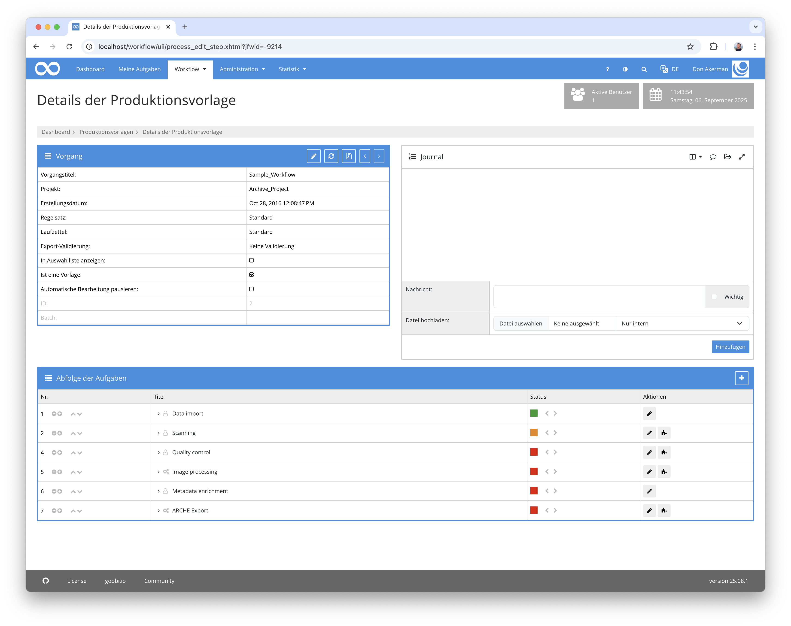
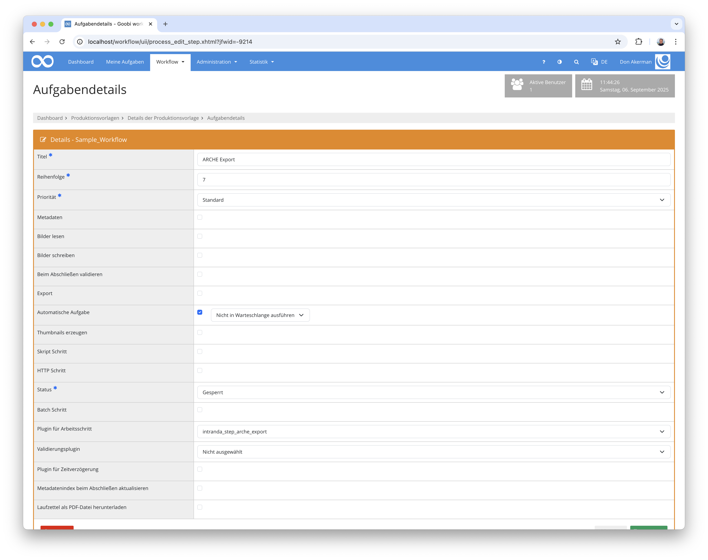

## Einführung
Diese Dokumentation erläutert das Plugin für den Import eines Vorgangs in ARCHE.

## Installation
Um das Plugin nutzen zu können, müssen folgende Dateien installiert werden:

```bash
/opt/digiverso/goobi/plugins/step/plugin-step-arche-export-base.jar
/opt/digiverso/goobi/plugins/lib/plugin-step-arche-export-lib.jar
/opt/digiverso/goobi/config/plugin_intranda_step_arche_export.xml
```

Zusätzlich muss das Plugin `intranda_administration_arche_project_export` installiert und konfiguriert sein.


Nach der Installation des Plugins kann dieses innerhalb des Workflows für die jeweiligen Arbeitsschritte ausgewählt und somit automatisch ausgeführt werden. Ein Workflow könnte dabei beispielhaft wie folgt aussehen:



Für die Verwendung des Plugins muss dieses in einem Arbeitsschritt ausgewählt sein:




## Überblick und Funktionsweise

Bevor der Dateningest nach ARCHE beginnen kann, finden eine Reihe von Validierungen statt. 

Zuerst wird geprüft, ob das Projekt, zu dem der Vorgang gehört, in ARCHE existiert. Ist dies nicht der Fall, kein keine Datenlieferung gemacht werden.
Anschließend wird geprüft, ob es den master-, media- und optional alto-Ordner gibt. Die Ordner müssen die gleiche Anhahl an Dateien enthalten, die Anzahl muss auch der Anzahl der Seiten in der Paginierung der METS Datei entsprechen.


Wenn die Validierung erfolgreich war, beginnen die Vorbereitungen für den Dateningest. Dafür werden die notwendigen URI für den Vorgang, die einzelnen Ordner und Dateien gebildet.

Anschließend wird anhand der Sprachcodes aus den Metadaten ermittelt. Ist dort kein Sprachcode hinterlegt, wird `und` für `undefined` genutzt. Da in Goobi Sprachen dreistellig nach iso639-2, ARCHE jedoch zweistellige iso639-1 Codes benötigt, findet noch ein Mapping statt.

Die Metadaten der Resourcen, die aus der METS-Datei stammen, werden mit diesem Sprachcode versehen. Alle anderen Felder wie Dateinamen, Anzahl der Dateien, Datumsangaben mit `en` oder `de`. 

Nun werden die einzelnen Resourcen gebildet. Beginnend mit der Collection Resource für den Vorgang, den Folder und File Resourcen für die Ordner, Bilder und ALTO Dateien sowie für interne und externe METS Dateien sowie gegebenenfalls der anchor Daten.

Bestimmte Metadaten wie Lizenzangaben, Rechteinhaber oder auch Owner, Depositor, Curator können aus dem Projekt vererbt werden.Zuerst wird nach der Eigenschaft innerhalb des Vorgangs gesucht. Existiert diese nicht, wird im Projekt nach einer Eigenschaft mit dem gleichen Namen gesucht. 

Anschließend findet der Ingest der RDF Metadaten sowie der Binaries innerhalb einer Transaction statt. Dabei wird für jede Resource und jedes Binary durch eine Suche nach dem Identifier gepfrüft, ob der Datensatz bereits in ARCHE existiert. Ist das der Fall, findet ein Update statt, ansonsten werden die Daten neu exportiert.

Wenn alle Daten vollständig nach ARCHE exportiert wurden, ist die Aufgabe erfolgreich abgeschlossen. Ansonsten wird ein vollständiger Rollback der Daten gemacht und der Schritt schlägt mit einer Fehlermeldung fehl. 

Für Debugging Zwecke können die RDF Metadaten auch optional in ein konfigurierbares Serververzeichnis exportiert werden.


## Konfiguration
Die Konfiguration des Plugins erfolgt in der Datei `plugin_intranda_step_arche_export.xml` wie hier aufgezeigt:

{{CONFIG_CONTENT}}

{{CONFIG_DESCRIPTION_PROJECT_STEP}}

Parameter               | Erläuterung
------------------------|------------------------------------
`exportFolder`          | Optionaler Order, in dem die generierten RDF-TTL Daten gespeichert werden können.
`language`              | Enthält das Mapping für dreistellige zu zweistellige Sprachcodes
`code`                  | Definiert das Mapping für einen einzelnen Code. Das Attribut `iso639-1` enthält den zu nutzenden zweistelligen Code,  `iso639-2` den sonst üblichen dreistelligen Code.
`licenses`              | Enthält eine Liste von Lizenzangaben
`license`               | Definiert eine einzelne Lizenzangabe. Eine Lizenz enthält immer den intern verwendeten Wert im Attribut `internalName` und die zu nutzende URI im Feld `archeField`. Die zu verwendenden URI sind hier definiert: https://vocabs.acdh.oeaw.ac.at/arche_licenses/en/