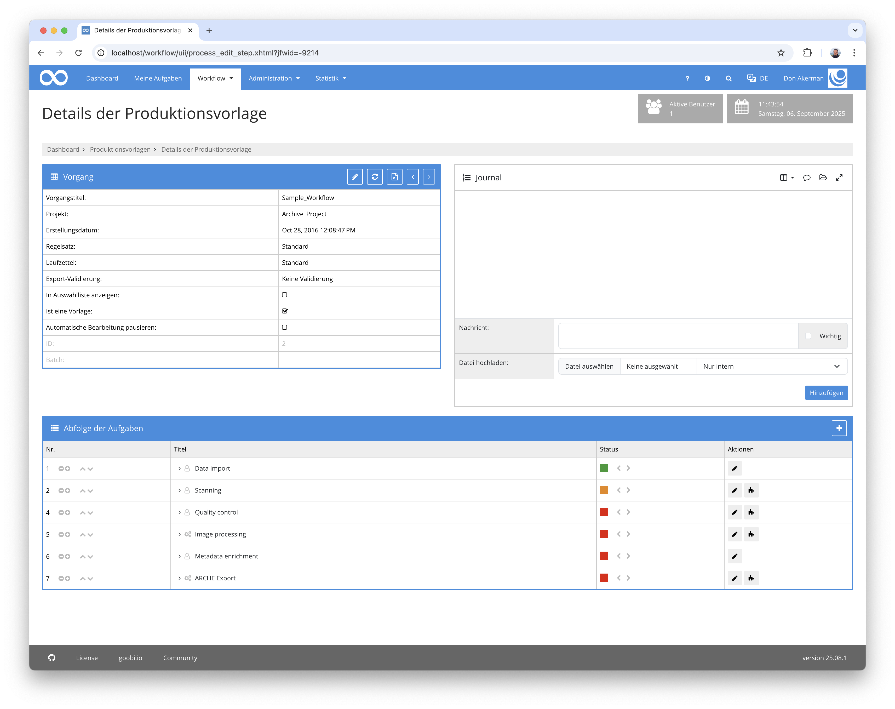
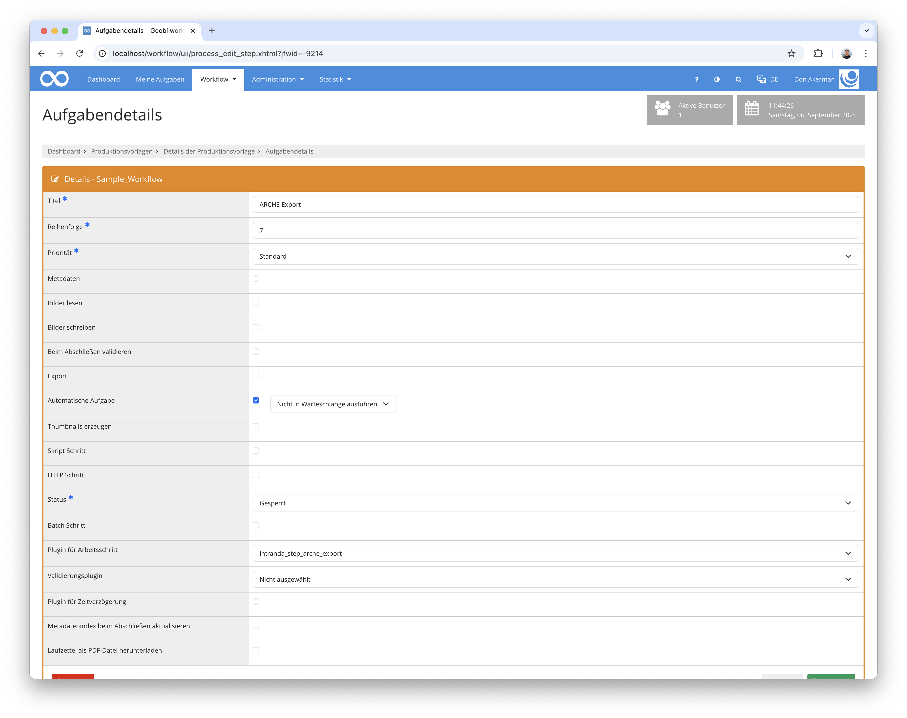

## Einführung
Diese Dokumentation erläutert das Plugin für den Import eines Vorgangs in ARCHE.

## Installation
Um das Plugin nutzen zu können, müssen folgende Dateien installiert werden:

```bash
/opt/digiverso/goobi/plugins/step/plugin-step-arche-export-base.jar
/opt/digiverso/goobi/plugins/lib/plugin-step-arche-export-lib.jar
/opt/digiverso/goobi/config/plugin_intranda_step_arche_export.xml
```

Zusätzlich muss das Plugin `intranda_administration_arche_project_export` installiert und konfiguriert sein.

Nach der Installation des Plugins kann dieses innerhalb des Workflows für die jeweiligen Arbeitsschritte ausgewählt und somit automatisch ausgeführt werden. Ein Workflow könnte dabei beispielhaft wie folgt aussehen:



Für die Verwendung des Plugins muss dieses in einem Arbeitsschritt ausgewählt sein:




## Überblick und Funktionsweise

Bevor der Dateningest nach ARCHE beginnen kann, finden eine Reihe von Validierungen statt:

- Zuerst wird geprüft, ob das Projekt, zu dem der Vorgang gehört, in ARCHE existiert. Ist dies nicht der Fall, kann keine Datenlieferung gemacht werden.
- Anschließend wird geprüft, ob es den master-, media- und optional alto-Ordner gibt. Die Ordner müssen die gleiche Anzahl an Dateien enthalten, die Anzahl muss auch der Anzahl der Seiten in der Paginierung der METS Datei entsprechen.

Wenn die Validierung erfolgreich war, beginnen die Vorbereitungen für den Dateningest. Dafür werden die notwendigen URIs für den Vorgang, die einzelnen Ordner und Dateien gebildet.

Anschließend wird der Sprachcode aus den Metadaten ermittelt. Ist dort kein Sprachcode hinterlegt, wird `und` für `undefined` genutzt. Da in Goobi Sprachen dreistellig nach `iso639-2`, ARCHE jedoch zweistellige `iso639-1` Codes benötigt, findet noch ein Mapping statt.

Die Felder `hasTitle` und `hasCity` der Resourcen, die aus der METS-Datei stammen, werden mit diesem Sprachcode versehen. Andere Metadatenfelder werden mit dem Sprachcode der Standardsprache des Projekts versehen. Wurde keine Sprachcode vergeben, wird der Default Wert `und` genutzt.

Nun werden die einzelnen Resourcen gebildet. Beginnend mit der `Collection Resource` für den Vorgang, den `Folder` und `File` Resourcen für die Ordner, Bilder und ALTO Dateien sowie für die meta.xml sowie gegebenenfalls der Anchor-Daten.

Welche Goobi-Metadatenfelder auf welche ARCHE-Eigenschaften gemappt werden, ist über `<metadataMappings>` in der Konfigurationsdatei steuerbar. Für jede Zuordnung kann zusätzlich das Sprachverhalten festgelegt werden (`DOC_LANGUAGE`, `DEFAULT_LANGUAGE`, `DATE`, `NO_LANGUAGE` oder ein expliziter iso-639-Tag).

Bestimmte Metadaten wie `Lizenzangaben`, `Rechteinhaber` oder auch `Owner`, `Depositor`, `Curator` können aus dem Projekt vererbt werden. Zuerst wird nach der Eigenschaft innerhalb des Vorgangs gesucht. Existiert diese nicht, wird im Projekt nach einer Eigenschaft mit dem gleichen Namen gesucht. Welche Goobi-Eigenschaften auf welche ARCHE-Felder gemappt werden, ist über `<propertyMappings>` in der Konfigurationsdatei steuerbar.

Es stehen je nach Konfiguration drei Optionen des Export zur Verfügung:
* Speichern der Datei in einem konfigurierten Verzeichnis. Dabei wird für jeden Vorgang im konigurierten Verzeichnis ein Unterordner erstellt, in den die TTL, sowie die eigentlichen Daten exportiert werden
* Validierung der TTL gegen die ARCHE Validation API. Hierzu wird jede Resource einzeln innerhalb einer `Transaction` gesendet. Sofern jede Resource mit einem HTTP Code 2xx akzeptiert wird, ist die Validierung erfolgreich. 
* Dateningest in ARCHE. Dabei werden alle Resourcen und alle Binaries einzeln innerhalb einer `Transaction` gesendet.

## Konfiguration
Die Konfiguration des Plugins erfolgt in der Datei `plugin_intranda_step_arche_export.xml` wie hier aufgezeigt:

{{CONFIG_CONTENT}}

{{CONFIG_DESCRIPTION_PROJECT_STEP}}

Parameter               | Erläuterung
------------------------|------------------------------------
`exportFolder`          | Optionaler Ordner, in dem die generierten RDF-TTL Daten gespeichert werden können.
`viewerUrl`             | Basis-URL der Goobi-Viewer-Instanz ohne abschließenden Schrägstrich (z.B. `https://viewer.example.org/viewer`). Wird verwendet, um `hasUrl`-Links der Form `{viewerUrl}/image/{id}` und `{viewerUrl}/toc/{id}` zu bilden.
`permalinkUrl`          | Basis-URL für Katalogressourcen (z.B. `https://permalink.example.org/`). Wird für `hasDescription`- und `hasUrl`-Werte der Form `{permalinkUrl}{id}` verwendet.
`language`              | Enthält das Mapping für dreistellige zu zweistellige Sprachcodes
`code`                  | Definiert das Mapping für einen einzelnen Code. Das Attribut `iso639-1` enthält den zu nutzenden zweistelligen Code, `iso639-2` den sonst üblichen dreistelligen Code.
`licenses`              | Enthält eine Liste von Lizenzangaben
`license`               | Definiert eine einzelne Lizenzangabe. Eine Lizenz enthält immer den intern verwendeten Wert im Attribut `internalName` und die zu nutzende URI im Feld `archeField`. Die zu verwendenden URIs sind hier definiert: https://vocabs.acdh.oeaw.ac.at/arche_licenses/en/
`metadataMappings`      | Enthält die konfigurierbaren Zuordnungen von Goobi-Metadatenfeldern zu ARCHE-Eigenschaften für `Publication`-Resourcen. Die Sonderfälle `TitleDocMain`, `TitleDocSub1`, `CatalogIDDigital`, `DateOfOrigin` und `DocLanguage` sind weiterhin fest im Code verankert und dürfen hier nicht eingetragen werden.
`metadataMapping`       | Definiert eine einzelne Feldzuordnung. Das Attribut `metadataName` enthält den Goobi-Metadatenfeldnamen, `archeField` den lokalen Namen der ARCHE-Eigenschaft. Das Attribut `language` steuert das Sprachverhalten: `DOC_LANGUAGE` = dokumentspezifischer Sprachcode, `DEFAULT_LANGUAGE` = Projektstandardsprache, `DATE` = typisiertes `xsd:date`-Literal, `NO_LANGUAGE` = einfaches String-Literal ohne Sprachtag, oder ein expliziter BCP-47-Tag wie `und` oder `en`.
`propertyMappings`      | Enthält die konfigurierbaren Zuordnungen von Goobi-Vorgangs- bzw. Projekteigenschaften zu ARCHE-Agenten-Eigenschaften für `Collection`-Resourcen.
`propertyMapping`       | Definiert eine einzelne Eigenschaftszuordnung. Das Attribut `goobiProperty` enthält den Goobi-Eigenschaftsnamen (zuerst im Vorgang gesucht, dann im Projekt), `archeField` den lokalen Namen der ARCHE-Eigenschaft.