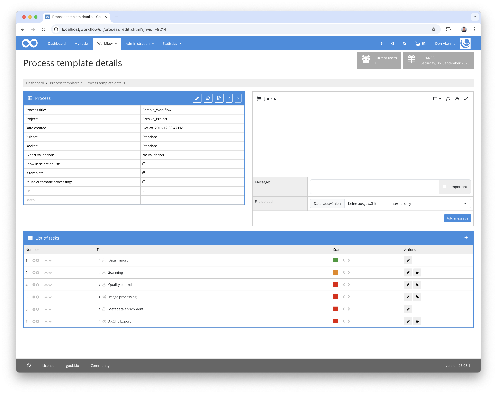
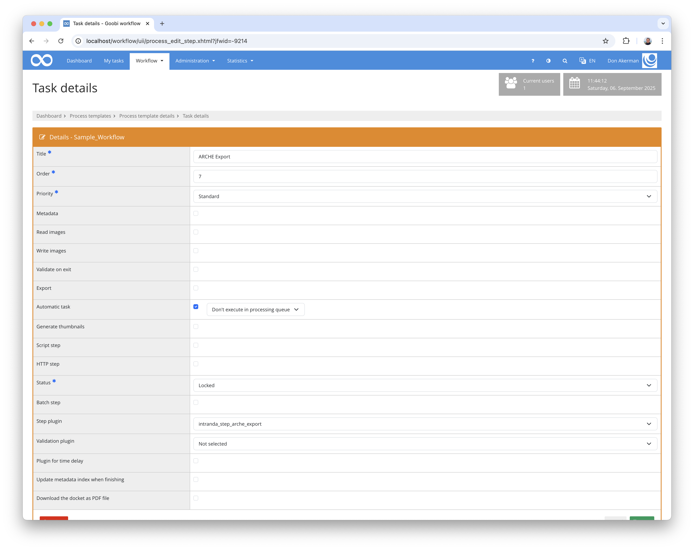

## Introduction
This documentation explains the plugin for importing a process into ARCHE.

## Installation
To use the plugin, the following files must be installed:

```bash
/opt/digiverso/goobi/plugins/step/plugin-step-arche-export-base.jar
/opt/digiverso/goobi/plugins/lib/plugin-step-arche-export-lib.jar
/opt/digiverso/goobi/config/plugin_intranda_step_arche_export.xml
```

In addition, the plugin `intranda_administration_arche_project_export` must be installed and configured.

After installing the plugin, it can be selected within the workflow for the respective work steps and thus executed automatically. An example workflow could look like this:



To use the plugin, it must be selected in a workflow step:




## Overview and functionality

Before data ingestion into ARCHE can begin, a series of validations take place:

- First, a check is made to see whether the project to which the process belongs exists in ARCHE. If this is not the case, no data delivery can be made.
- Next, a check is performed to see whether the master, media and, optionally, alto folders exist. The folders must contain the same number of files, and the number must also correspond to the number of pages in the pagination of the METS file.

If the validation is successful, preparations for data ingest begin. To do this, the necessary URIs for the process, the individual folders and files are created.

The language code is then determined from the metadata. If no language code is stored there, `und` is used for `undefined`. Since Goobi uses three-digit languages according to `iso639-2`, but ARCHE requires two-digit `iso639-1` codes, a mapping is also performed.

The metadata of the resources originating from the METS file is assigned this language code. All other fields, such as file names, number of files and dates, are assigned `en` or `de`.

Now the individual resources are created. Starting with the Collection Resource for the process, the Folder and File resources for the folders, images and ALTO files, as well as for internal and external METS files and, if necessary, the anchor data.

Certain metadata such as `Licence Information`, `Rights Holder` or `Owner`, `Depositor`, `Curator` can be inherited from the project. First, the property is searched for within the process. If it does not exist, the project is searched for a property with the same name. 

The RDF metadata and binaries are then ingested within a `transaction`. For each resource and binary, a search for the identifier is performed to check whether the data record already exists in ARCHE. If this is the case, an update is performed; otherwise, the data is re-exported.

Once all data has been fully exported to ARCHE, the task is successfully completed. Otherwise, a complete rollback of the data is performed and the step fails with an error message.

For debugging purposes, the RDF metadata can also be optionally exported to a configurable server directory.


## Configuration
The plugin is configured in the file `plugin_intranda_step_arche_export.xml` as shown here:

{{CONFIG_CONTENT}}

{{CONFIG_DESCRIPTION_PROJECT_STEP}}

Parameter               | Explanation
------------------------|------------------------------------
`exportFolder`          | Optional order in which the generated RDF-TTL data can be stored.
`language`              | Contains the mapping for three-digit to two-digit language codes
`code`                  | Defines the mapping for a single code. The attribute `iso639-1` contains the two-letter code to be used,  `iso639-2` the usual three-letter code.
`licenses`              | Contains a list of licence details
`license`               | Defines a single licence specification. A licence always contains the internally used value in the `internalName` attribute and the URI to be used in the `archeField` field. The URIs to be used are defined here: https://vocabs.acdh.oeaw.ac.at/arche_licenses/en/