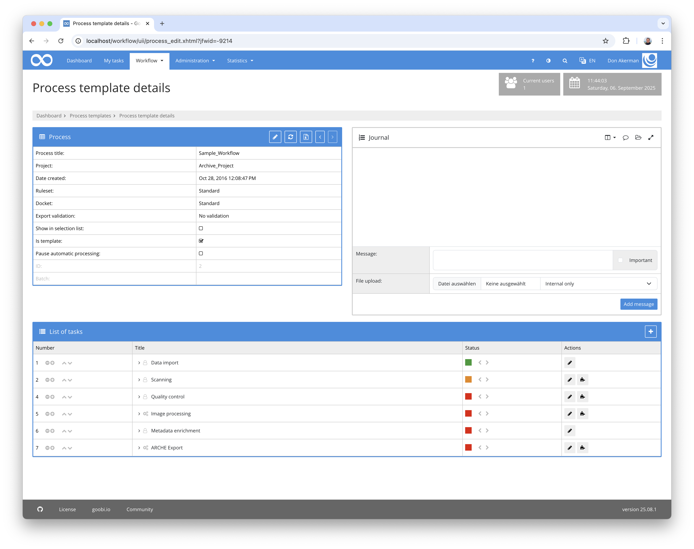
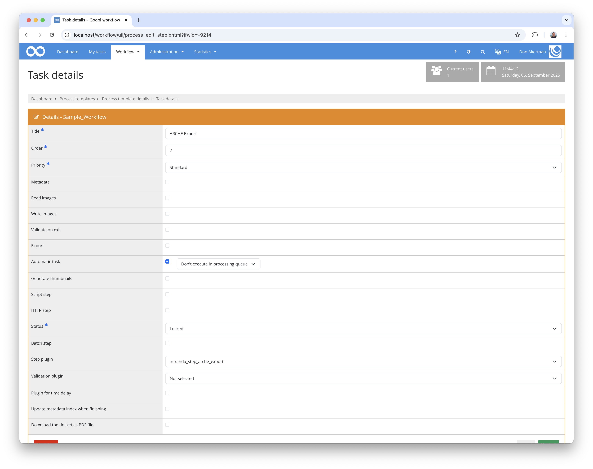

## Introduction
This documentation explains the plugin for importing a process into ARCHE.

## Installation
To use the plugin, the following files must be installed:

```bash
/opt/digiverso/goobi/plugins/step/plugin-step-arche-export-base.jar
/opt/digiverso/goobi/plugins/lib/plugin-step-arche-export-lib.jar
/opt/digiverso/goobi/config/plugin_intranda_step_arche_export.xml
```

In addition, the plugin `intranda_administration_arche_project_export` must be installed and configured.

After installing the plugin, it can be selected within the workflow for the respective work steps and thus executed automatically. An example workflow could look like this:



To use the plugin, it must be selected in a workflow step:




## Overview and functionality

Before data ingestion into ARCHE can begin, a series of validations take place:

- First, a check is made to see whether the project to which the process belongs exists in ARCHE. If this is not the case, no data delivery can be made.
- Next, a check is performed to see whether the master, media and, optionally, alto folders exist. The folders must contain the same number of files, and the number must also correspond to the number of pages in the pagination of the METS file.

If the validation is successful, preparations for data ingest begin. To do this, the necessary URIs for the process, the individual folders and files are created.

The language code is then determined from the metadata. If no language code is stored there, `und` is used for `undefined`. Since Goobi uses three-digit languages according to `iso639-2`, but ARCHE requires two-digit `iso639-1` codes, a mapping is also performed.

The `hasTitle` and `hasCity` fields of the resources originating from the METS file are assigned this language code. Other metadata fields are assigned the language code of the project’s default language. If no language code has been assigned, the default value `und` is used.

The individual resources are now created. Starting with the `Collection Resource` for the process, the `Folder` and `File` resources for the folders, images and ALTO files, as well as for the meta.xml and, where applicable, the anchor data.

Which Goobi metadata fields are mapped to which ARCHE properties can be controlled via `<metadataMappings>` in the configuration file. For each mapping, the language behaviour can also be specified (`DOC_LANGUAGE`, `DEFAULT_LANGUAGE`, `DATE`, `NO_LANGUAGE` or an explicit ISO 639 tag).

Certain metadata such as `Licence Information`, `Rights Holder` or `Owner`, `Depositor`, `Curator` can be inherited from the project. First, the property is searched for within the transaction. If it does not exist, the project is searched for a property with the same name. Which Goobi properties are mapped to which ARCHE fields can be controlled via `<propertyMappings>` in the configuration file.

Depending on the configuration, there are three export options available:
* Saving the file to a configured directory. For each operation, a subfolder is created within the configured directory, into which the TTL and the actual data are exported
* Validate the TTL against the ARCHE Validation API. To do this, each resource is sent individually within a `Transaction`. If each resource is accepted with an HTTP 2xx status code, the validation is successful.
* Data ingestion into ARCHE. All resources and all binaries are sent individually within a `Transaction`.

## Configuration
The plugin is configured in the file `plugin_intranda_step_arche_export.xml` as shown here:

{{CONFIG_CONTENT}}

{{CONFIG_DESCRIPTION_PROJECT_STEP}}

Parameter               | Explanation
------------------------|------------------------------------
`exportFolder`          | Optional folder in which the generated RDF-TTL data can be stored.
`viewerUrl`             | Base URL of the Goobi Viewer instance without a trailing slash (e.g. `https://viewer.example.org/viewer`). Used to build `hasUrl` links of the form `{viewerUrl}/image/{id}` and `{viewerUrl}/toc/{id}`.
`permalinkUrl`          | Base URL for catalogue permalink links (e.g. `https://permalink.example.org/`). Used for `hasDescription` and `hasUrl` values of the form `{permalinkUrl}{id}`.
`language`              | Contains the mapping for three-digit to two-digit language codes
`code`                  | Defines the mapping for a single code. The attribute `iso639-1` contains the two-letter code to be used, `iso639-2` the usual three-letter code.
`licenses`              | Contains a list of licence details
`license`               | Defines a single licence specification. A licence always contains the internally used value in the `internalName` attribute and the URI to be used in the `archeField` field. The URIs to be used are defined here: https://vocabs.acdh.oeaw.ac.at/arche_licenses/en/
`metadataMappings`      | Contains the configurable mappings from Goobi metadata fields to ARCHE properties for `Publication` resources. The special cases `TitleDocMain`, `TitleDocSub1`, `CatalogIDDigital`, `DateOfOrigin` and `DocLanguage` remain hardcoded and must not be added here.
`metadataMapping`       | Defines a single field mapping. The attribute `metadataName` contains the Goobi metadata field name, `archeField` the local name of the ARCHE property. The `language` attribute controls the language behaviour: `DOC_LANGUAGE` = document-specific language code, `DEFAULT_LANGUAGE` = project default language, `DATE` = typed `xsd:date` literal, `NO_LANGUAGE` = plain string literal without a language tag, or an explicit BCP-47 tag such as `und` or `en`.
`propertyMappings`      | Contains the configurable mappings from Goobi process or project properties to ARCHE agent properties for `Collection` resources.
`propertyMapping`       | Defines a single property mapping. The attribute `goobiProperty` contains the Goobi property name (searched first in the process, then in the project), `archeField` the local name of the ARCHE property.